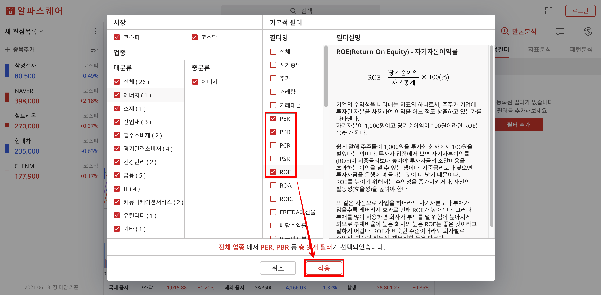

# 종목발굴하기 - 알파스퀘어

투자 지표별로 종목들을 뽑아서 오름차순으로 확인하는 것은 HTS, MTS에도 있는 기능이긴 한데, 나는 최근에 data.krx.co.kr 과 알파스퀘어를 유용하게 사용하고 있다.   

오늘 정리할 내용은 그 중에서도 한국주식 들을 투자 지표별로 모아서 보는 법에 대해 정리해보려고 한다.  

분기별로 데이터가 달라지기 때문에, 실적 발표나는 매 분기 초 또는 발표 후에 검색을 주기적으로 해야 할 것 같다.  

또는 EC2에 크롤링 프로그램을 파이썬으로 돌려두고 s3에 엑셀로 쌓아두는 것도 좋은 선택이다!!😀  

근데, 개인적인 경험으로... 그럴 시간에 투자관련 책을 몇 페이지 더 읽는게 낫고, 보고서 읽어주는 유투브/팟캐스트 하나 더 보는게 낫더라.  

## 알파스퀘어 방문

[알파스퀘어](https://www.alphasquare.co.kr/) 에 방문해서 시작하기 버튼 클릭

## 발굴분석 &gt; 종목필터 &gt; 필터 추가

## 필터선택 &gt; 적용

원하는 필터들을 선택후 적용버튼 클릭.  

나의 경우는 PER, PBR, ROE를 선택했다  

## 데이터 범위 설정 &gt; 종목 추출

## PER 순으로 정렬 &gt; 한솔홀딩스 선택 &gt; 왼쪽 화면 차트 확인

PER 순으로 정렬하면, 현재 주가가 주당 순이익에 비해 낮게 매겨진 순서대로 표시되는데, 표시된 종목을 클릭하면 차트도 확인 가능하다.  

## 엑셀에 옮겨두기

> * 엑셀에 옮겨두고, 구글드라이브에서 확인하려면 스프레드 시트가 낫겠다는 생각이 들어서 나의 경우는 스프레드시트에 Ctrl +C, Ctrl + V 했다.
> * 아직 나는 주식 초보티를 벗지 못해서인지, ROE가 어느정도 이상이 좋은지를 감을 못잡는것 같다. 그래서 일단은 항상 저평가된 종목을 찾는 기준으로 찾는다. \(PER : 1~10, PBR : 0~1, ROE: 잘 몰라서 5~20\)
> * 고수분들은 아마도 ROE,EPS 기준으로 찾은뒤에 적당한 PER, PBR을 찾지 않을까 싶기도 하다.
> * 또는 보수적으로 시가총액이 어느정도 큰 주식을 먼저 찾고 PER 순으로 정렬하는 경우도 있지 않을까 싶다. \(중단기 투자로 빈집털이 하는 경우...\)

아래에 빨간 테두리로 표시한 영역의 텍스트를 클립보드에 복사하자

* 빨간 테두리 영역 드래그 &gt; Ctrl + C 

엑셀에 붙여넣기

## 2021/06/20

주식 처음해볼때는 적은돈으로 약간 도박처럼 했었다. 이런 업종이 뜰거야!! 하는 문과적인 생각으로 접근했다.  

조금씩 주식계좌에 넣는 돈이 많아질 수록 배짱이 필요했는데, 그 배짱은 마음에서 오는게 아니라, 데이터에서 오는 안도감이라는 생각이 최근에 들었다.  

가치투자에 필요한 여러가지 개론들은 [이웃집 워런 버핏, 숙향의 주식 투자 이야기](http://www.yes24.com/Product/Goods/94517281) 에서 어느 정도 영향을 받았고, 그 외 [채권쟁이 서준식의 다시 쓰는 주식 투자 교과서](http://www.yes24.com/Product/Goods/66889829) 를 봤는데, 두 책 모두 아직 다 읽지 못했다. 아직도 공부중이다.  

아직 공부중!!! 이다. 다시 강조하지만, 난 그냥 **투자 공부중!!!** 이다. 그리고 여긴 **그냥 개인 블로그** 일 뿐이다   

